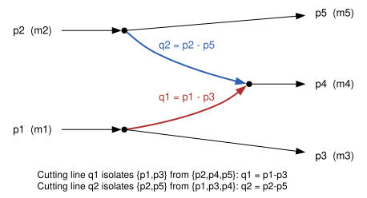
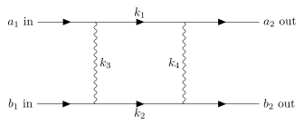
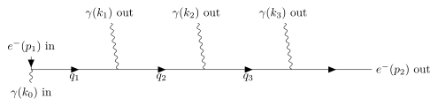

# Discussion notes — Part 5 (multiperipheral kinematics)

Running log of questions/derivations as we work through uam19 `part5.pdf`
together. This is the scratch/discussion record; `README.md` will summarize
the settled conclusions once we've covered enough ground.

---

## Topic 0: what "tree diagram" and "loop" actually mean

Topic 3 (below) proves a fact about internal-line momenta in tree
diagrams, but uses "tree diagram" as if it were self-evident. This topic
was inserted *after* Topic 3 was written, once a question exposed that
"tree = no loops" needs its own careful definition, and that "no loops"
itself is not simply "no closed shape when you draw it," but a precise
statement about how many internal momenta are left undetermined. This
section works from first principles and corrects two mistakes made along
the way (both documented below, not hidden), because seeing what went
wrong is as instructive as the final definitions.

### Setting up the general framework

Every internal line of a Feynman diagram carries a momentum. Every vertex
enforces 4-momentum conservation: with a fixed reference direction assigned
to each line,

$$\sum_{\text{lines }\ell\text{ at vertex }v} \sigma_{\ell,v}\,q_\ell = 0,
\qquad \sigma_{\ell,v}=\begin{cases}+1 & \ell\text{ into }v\\-1&\ell\text{ out of }v\end{cases}$$

A diagram with $V$ vertices gives you $V$ such vector equations. But they
are never all independent: summing **all** of them together, every
internal line appears exactly twice (once from each of its two endpoints)
with opposite sign, so it cancels completely — what remains is exactly
overall momentum conservation of the external legs. That means summing
*all* $V$ vertex equations reproduces a fact you already know is true
(total incoming momentum = total outgoing momentum) rather than giving new
information. So there are only

$$V - 1$$

**independent** vertex constraints, not $V$. (This "one equation is always
redundant" fact is the same telescoping mechanism used in Topic 3's proof,
just applied to *all* vertices at once instead of one side of a single
cut.)

### A terminology warning: "external" is a graph role, not "physically fixed"

Before going further, one distinction has to be nailed down, because this
document uses "external momentum" in two senses that must not be
conflated, and an earlier draft of this document did conflate them
(flagged and fixed here): **"external" as used in this constraint-counting
argument, and in Topic 3's proof, means "external to the diagram graph"**
— a leg that is not itself an internal propagator solved for by the
vertex equations. It says nothing about whether that leg's momentum is
held fixed across an entire calculation.

Concretely, for our own diagram: $p_1,p_2$ (the beam momenta) *are*
physically fixed once and for all by the experiment (the beam energy).
But $p_3,p_4,p_5$ (the final-state momenta) are "external" only in the
graph-topological sense used here — they are not internal lines, so
Topic 3's proof treats them as the given data from which $q_1,q_2$ are
*derived*, for any *one* diagram evaluation. Across a full cross-section
calculation, however, $p_3,p_4,p_5$ are exactly what the phase-space
integral ranges over — they are not fixed at all once you zoom out from
"one diagram evaluation" to "the integral over all of phase space." Both
statements are true, about the same symbols, because they answer
different questions: "is $p_3$ solved-for by the vertex equations of
*this* diagram?" (no — it's external, in that sense) vs. "does $p_3$ take
one fixed numerical value throughout the calculation?" (no — it's an
integration variable). This distinction is used without further comment
from here on; see the "How can a tree diagram peak at all" subsection of
Topic 1 for why it matters.

### The definition (constraint-counting, not graph-shape)

Let $E$ be the number of **internal** lines (propagators) in the diagram —
these are the unknowns, solved for by the vertex-conservation equations in
terms of whatever values the diagram's external legs happen to carry (see
the terminology warning just above — "given" here means "given once you
fix a point in phase space," not "fixed for the whole calculation").
Compare unknowns to independent constraints:

$$L \;=\; E - (V-1) \;=\; E - V + 1$$

- **$L=0$: every internal momentum is uniquely fixed** by the external
  momenta via the vertex equations alone. Nothing is left to choose or
  integrate over. **This is what "tree diagram" means.**
- **$L>0$: after using every independent constraint, $L$ internal momenta
  remain genuinely free** — not fixed by anything external. Quantum
  mechanically, *every* value such a free momentum could take contributes
  to the amplitude, so the Feynman rules require summing (integrating)
  over all of them: $\prod_{i=1}^{L}\int \frac{d^4k_i}{(2\pi)^4}$. **This
  is the actual definition of a loop, and $L$ is the loop order** — not
  "does the picture look like it has a closed shape," but "how many
  internal momenta does the vertex-constraint system leave undetermined."

The fact that $L$ also equals the number of independent cycles in the
diagram-as-a-graph is a **theorem**, not the definition — provable from
the constraint-counting picture above, and checked concretely below rather
than assumed.

### Correction #1 (made mid-discussion): a diagram is not "non-tree" just because $V>2$

An early wrong claim in this discussion was that "any diagram with more
than 2 vertices is automatically non-tree." This is false, and falsified
directly by explicit graphs (all checked with `networkx.is_tree`):

| diagram | $V$ | $E$ | $L=E-(V-1)$ | tree? |
|---|---|---|---|---|
| our multiperipheral diagram ($A,B,C$) | 3 | 2 | 0 | yes |
| 4-vertex **chain** $A$–$C$–$D$–$B$ | 4 | 3 | 0 | **yes** |
| 4-vertex **star** ($C$ hub, $A,B,D$ leaves) | 4 | 3 | 0 | **yes** |
| 4-vertex **box** (rectangle, see Topic "loop example" below) | 4 | 4 | 1 | no |
| 10-vertex random tree | 10 | 9 | 0 | yes |

Two of the rows have **the same vertex count ($V=4$)** yet different
answers (tree vs. not) — so $V$ alone cannot possibly be the deciding
factor; a 10-vertex diagram can be a perfectly good tree. What actually
decides it is $E$ **relative to** $V-1$: a tree always has exactly one
fewer internal line than it has vertices ($E=V-1$); anything with one more
internal line than that ($E=V$) has exactly one loop, and so on. This
matters because "just count vertices" was floated as a shortcut — it
isn't one; it gives the wrong answer on two of the five rows above.

### Correction #2 (made mid-discussion): a naive symbolic check can give a false negative

While verifying the tree case symbolically (below), an initial check of
"is vertex $C$'s equation implied by $A$'s and $B$'s?" returned **False**
in `sympy`. This was not a flaw in the argument — it was a bug in the
check: $p_4$ was left as an unconstrained free symbol instead of also
being expressed via overall conservation
($p_1+p_2=p_3+p_4+p_5$) before comparing. Once that substitution is made,
the check correctly returns `0` (true). Recorded here because it's a
useful lesson for any future symbolic verification in this repo: **always
impose overall external-momentum conservation explicitly before checking
whether a vertex equation is "automatically satisfied" — otherwise the
external momenta look independent when they are not**, and the check will
spuriously fail. The same bug appeared a second time (below, in the box
case, where it produced `EmptySet` instead of a clean "no solution" or
"one free parameter" answer) before being caught and fixed identically.

### Worked example 1: our diagram is a tree ($L=0$)



(source: `figures/multiperipheral.tex`, `tikz-feynman` — same figure used
again in Topic 3's diagram section below, since it's the same diagram.)

Vertex equations (incoming-positive convention):

- Vertex $A$: $p_1 = p_3+q_1 \Rightarrow q_1=p_1-p_3$
- Vertex $B$: $p_2 = p_5+q_2 \Rightarrow q_2=p_2-p_5$
- Vertex $C$: $q_1+q_2=p_4$

$V=3$, so independent constraints $=V-1=2$. Solving using only vertices
$A,B$ (2 equations, 2 unknowns $q_1,q_2$) gives a **unique** solution,
matching `pickin.c:16`'s own `t1=(p1-p3)^2, t2=(p2-p5)^2`. Vertex $C$'s
equation, checked with overall conservation $p_1+p_2=p_3+p_4+p_5$ imposed:

```python
import sympy as sp
p1,p2,p3,p4,p5,q1,q2 = sp.symbols('p1 p2 p3 p4 p5 q1 q2')
sol = {q1: p1-p3, q2: p2-p5}                          # from vertices A,B
p4_expr = sp.solve(sp.Eq(p1+p2, p3+p4+p5), p4)[0]       # overall conservation
sp.simplify((q1+q2).subs(sol) - p4_expr)                 # -> 0: vertex C is automatic
```

$E=2$, $L=E-(V-1)=2-2=0$. **Tree**, confirming Topic 3's proof applies.

### Worked example 2: the box diagram is one loop ($L=1$)

Two fermion lines ($a_1\to a_2$ and $b_1\to b_2$) exchanging two photons,
forming a closed rectangle — a standard one-loop QED box (two-photon
exchange):



(source: `figures/box_loop.tex`, a repo-native `tikz-feynman` diagram —
originally sketched from a photo the user shared outside the repo, rebuilt
here rather than referencing that external file, using the standard
particle-physics drawing convention: straight fermion lines with arrows,
sine-wave photon propagators, compiled with `lualatex` and converted to
SVG.)

Two fermion lines run through the diagram: $a_1\to TL\to TR\to a_2$ (top,
labeled $k_1$ on the internal segment) and $b_1\to BL\to BR\to b_2$
(bottom, $k_2$), exchanging two photons $k_3$ (left) and $k_4$ (right).
The prose and algebra below use position-based names ($TL,TR,BL,BR$ for
the vertices; $k_{top}=k_1$, $k_{bottom}=k_2$ for the two fermion
segments, $k_{left}=k_3$, $k_{right}=k_4$ for the two photons) since those
map directly onto the proof; the figure labels are the same four internal
lines under their $k_1$–$k_4$ names. The loop
**is** the full rectangle, walked $TL\to TR\to BR\to BL\to TL$: cutting
any one of the four internal lines leaves the other three still
connecting all four vertices, so no single cut disconnects the diagram —
the graph-theoretic signature of $L\geq1$.

$V=4$, $E=4$ (one more than the $V-1=3$ a tree would have). Solving the
vertex-conservation system explicitly (imposing overall external
conservation $a_1+b_1=a_2+b_2$ first, per Correction #2 above):

```python
import sympy as sp
kt,kr,kb,kl = sp.symbols('k_top k_right k_bottom k_left')
a1,a2,b1,b2 = sp.symbols('a1 a2 b1 b2')
eqTL = sp.Eq(a1, kt+kl); eqTR = sp.Eq(kt+kr, a2)
eqBL = sp.Eq(b1+kl, kb); eqBR = sp.Eq(kb, b2+kr)
a2_expr = sp.solve(sp.Eq(a1+b1, a2+b2), a2)[0]
sp.linsolve([eqTL, eqTR.subs(a2,a2_expr), eqBL, eqBR], [kt,kr,kb,kl])
# -> {(a1 - k_left,  b1 - b2 + k_left,  b1 + k_left,  k_left)}
```

Every internal momentum ($k_{top},k_{right},k_{bottom}$) comes out
expressed *in terms of* `k_left` — but `k_left` itself is never pinned to
a value by any combination of the four vertex equations. That is the loop
momentum: exactly the free parameter the definition predicts, matching
$L=E-(V-1)=4-3=1$. Physically you'd write the amplitude with
$\int d^4k_{\text{left}}/(2\pi)^4$ left in it — a genuine one-loop QED box
diagram (two-photon exchange correction).

### Worked example 3: a 4-vertex diagram that is *still* a tree ($L=0$)

Direct answer to "why bother with $E-V+1$, why not just count vertices" —
here is a diagram with the *same* vertex count as the box above ($V=4$)
that is nonetheless a tree, because its 3 internal lines form a **chain**,
not a cycle:



(source: `figures/chain4.tex`, `tikz-feynman`.) Process: $\gamma + e^- \to e^- + \gamma +
\gamma + \gamma$ — an incoming photon Compton-scatters off an electron,
which radiates two extra bremsstrahlung photons, drawn as one continuous
fermion line running through 4 vertices $A,C,D,B$, each vertex emitting
one photon. **Every vertex was checked to be a genuine QED vertex** (2
fermion legs + 1 photon leg each — an earlier draft of this diagram
mistakenly gave vertices $A$ and $B$ three fermion legs and zero photons,
which is not a valid QED vertex; fixed by making one of each end-vertex's
external legs a photon instead of a fermion):

| vertex | legs | valid? |
|---|---|---|
| $A$ | $e^-_{\text{in}}$, $\gamma_{\text{in}}$, $q_1$ (fermion, out) | 2 fermion + 1 photon — yes |
| $C$ | $q_1$ (fermion, in), $q_2$ (fermion, out), $\gamma_1$ (out) | 2 fermion + 1 photon — yes |
| $D$ | $q_2$ (fermion, in), $q_3$ (fermion, out), $\gamma_2$ (out) | 2 fermion + 1 photon — yes |
| $B$ | $q_3$ (fermion, in), $e^-_{\text{out}}$, $\gamma_3$ (out) | 2 fermion + 1 photon — yes |

Solving vertices $A,C,D$ (3 equations, 3 unknowns $q_1,q_2,q_3$) gives a
unique solution; vertex $B$'s equation is then automatically satisfied
once overall conservation is imposed (checked, returns `0`, same pattern
as worked example 1). $V=4$, $E=3=V-1$, so $L=E-(V-1)=3-3=0$: **tree**,
despite having the same vertex count as the one-loop box in example 2.

**This is the direct resolution of the "why not just count vertices"
objection:** examples 2 and 3 both have $V=4$; one is a tree, one is a
one-loop diagram. Vertex count cannot distinguish them — only the
relationship between $E$ and $V-1$ can, because that relationship is
precisely asking "does the vertex-conservation system have a unique
solution, or is something left over to integrate?", which is the actual
physical question at stake.

### Where the graph-theoretic "cycle" picture fits in

The geometric fact "cutting an edge from a tree always disconnects it,
cutting an edge from the box's rectangle does not" (visible directly by
inspection, and used informally earlier in this discussion) is not a
separate, alternative definition — it is a **theorem** that follows from
the constraint-counting definition above: a free/undetermined internal
momentum is precisely one you can route "around a closed path" without
violating any vertex equation, and closed paths in a connected graph exist
exactly when $E>V-1$. Both pictures were checked to agree in every example
above ($E-(V-1)$ arithmetic vs. `networkx.is_tree`/`cycle_basis`), which is
why either is a legitimate way to *check* tree-vs-loop in practice — but
the constraint-counting definition is the one that explains *why* it
matters physically (integration variables), and is the one to reach for
first when a diagram's shape is ambiguous or hard to draw.

---

## Topic 1: "peaks", "types of peaks", and why propagator count grows like $O(2^n)$

### The source sentence

> "...when there are many Feynman diagrams in a reaction, there can be many
> different types of peaks and the number of potential propagators that can
> cause peaking grows like $O(2^n)$, while the number of non-trivial
> integration variables is at most $3n-4$."
> — uam19 `part5.pdf`, p.1

### Parsing it precisely

The sentence makes **two separate claims**, and it's important not to
collapse them into one (an error corrected during this discussion):

1. **Qualitative claim:** "there can be many different **types** of peaks."
   This is about *kinds* of peaks, not a count.
2. **Quantitative claim:** "the number of potential **propagators** that can
   cause peaking grows like $O(2^n)$." The grammatical subject being counted
   is *propagators*; "that can cause peaking" is a restrictive clause
   narrowing which propagators are in view (only ones capable of going
   small/near-singular in the accessible kinematic region) — it is not a
   second, independently-counted quantity.

The two claims are related but distinct: claim 2 (propagator count) explains
*one* source of the "many different types" in claim 1, but not the only one.

### "Peak" vs. "pole"/"singularity" — deliberate, not sloppy

Vermaseren uses "peak" as the general/operative term and "pole" as a
narrower one — he writes "peaks/poles" later in the same paragraph, showing
he has both words available and chooses deliberately:

- A **pole** is a property of the integrand *function* — a point where a
  propagator denominator $q^2 - m^2$ hits exactly zero, making the
  integrand formally infinite.
- A **peak** is the *numerically relevant* property for Monte Carlo: a
  region where the integrand is large and sharply varying. Every pole
  produces a peak (if the accessible phase-space region gets close to it),
  but not every peak comes from a true pole — e.g. a Jacobian factor like
  $1/\sqrt{-\Delta_4}$ (see `orient.c`'s doc comment on the Gram
  determinant) peaks without any propagator going on-shell, and the
  numerator/denominator near-cancellation in `pi0.c` (formula 3.2, the
  $1/(t_1t_2)^2$ term) produces a numerically dangerous region without a
  literal pole there either.

So the "different types of peaks" (claim 1) plausibly include at least:

- **Propagator peaks** — $1/(q_i^2-m_i^2)$ small for some internal line $i$.
  This is what claim 2 counts, and what `mapt.c` (the `dt/t` mapping) and
  `t1`/`t2` in `pickin.c` exist to tame.
- **Phase-space-measure/Jacobian peaks** — e.g. the $1/\sqrt{-\Delta_4}$
  factor `orient.c` calls out, unrelated to any single propagator.
- **Cancellation peaks** — large near-equal terms nearly canceling (the
  $O(s^2 M_\pi^4)$ numerator terms in `pi0.c` that the whole Part 5 lecture
  is fundamentally about). Not a pole anywhere; numerically peak-like
  because relative precision collapses there.

### How can a tree diagram peak at all, if every momentum is uniquely determined?

A sharp objection worth resolving before going further: Topic 3 proved
that in a tree diagram, every internal-line momentum is a *fixed*,
uniquely-determined function of the external momenta (a signed
subset-sum). If nothing is left free or undetermined the way a loop
momentum is, where could a "peak" or a "non-trivial integral" possibly
come from?

**Resolution: "uniquely determined" and "integrated over" are not in
tension, once "external momentum" is read in the sense fixed in Topic 0's
terminology warning** ("external to the diagram graph," not "physically
fixed for the whole calculation"). Topic 3's proof fixes *a single point*
$p_1,\dots,p_5$ in phase space and derives $q_1,q_2$ from *that one*
choice — true, and not in question; that is what "external, in the
graph-topological sense" buys you at that one point. But a cross section
is not the integrand evaluated at one kinematic point; it is
$$\sigma \propto \int d\Phi_n(p_3,\dots,p_{n+2}) \; |\mathcal{M}|^2,$$
an integral over *every* kinematically allowed choice of the final-state
momenta. $t_1,t_2,s_2,\cos\theta_4$ (Topic 2's $3n-4=5$, minus the
trivial azimuth) are not extra freedoms *inside* one diagram's
kinematics — they parametrize *which point of the final-state phase
space you are currently at*. For each such point, $q_1=p_1-p_3$ is
indeed uniquely fixed, exactly as Topic 3 proved; the peak is not a peak
"in $q_1$" holding externals fixed, it is a peak **in the integrand as a
function of where in phase space you are evaluating it**, as $t_1$ itself
(one of the integration variables) sweeps close to its own on-shell value.

**This is directly visible in the code, not just an abstract argument.**
`eepi.c:14-20` — the function VEGAS calls once per Monte Carlo
sample — takes only two things as genuinely fixed input: the beam energy
`eemminput.sq` and the particle masses. It takes four **freshly-drawn
random numbers** `rannums[0..3]` (uniform on $[0,1]$) as its actual
per-call input, and *everything else, including $t_1,t_2$ and hence the
final-state momenta $p_3,p_4,p_5$, is derived inside `pickin`/`orient`
from those random numbers, fresh every call*:

```c
extra.t1 = mapt(t1min,t1max,&dt1,rannums[0],1);      // pickin.c:93
```

`t1min`,`t1max` (`pickin.c:90-92`) depend only on the fixed beam energy
and masses — **not** on `rannums`. So as `rannums[0]` sweeps $[0,1]$
across many VEGAS calls, `t1` sweeps continuously across its *entire*
physically allowed range $[t1min,t1max]$. For any *one* call, $t_1$ (and
hence $q_1=p_1-p_3$) is a single fixed number — but across the full
Monte Carlo run, $t_1$ takes on every value in that range, including
values arbitrarily close to its physical edge.

**Where the actual singularity sits, and why it's reachable.** `mapt.c`'s
own doc comment (`mapt.c:15`) states the mapping's purpose directly:

```c
/*
    Assumes dt/t.   t < 0
*/
```

$t_1$ is a spacelike momentum transfer, always $t_1<0$, and can approach
$t_1\to0^-$ within the physically allowed range — exactly where the
propagator denominator in `pi0.c`'s matrix element,
`part1 = -64*levi.gram/(tt*tt)` with `tt = extra.t1*extra.t2`
(`pi0.c:9`), blows up as $1/t_1^2$. `pickin.c:93` calls `mapt(...,
rannums[0], 1)` with `type=1`, i.e. the $dt/t$ log-mapping is what
actually runs — built for exactly this reason: a *flat* (uniform,
`type=0`) sampling of $t_1$ would place very few Monte Carlo samples near
$t_1\to0^-$ (a small sub-interval, linearly), even though that is
precisely where the integrand is largest and contributes most of the
cross section — the classic Monte Carlo variance problem. The $dt/t$ map
instead concentrates sample density logarithmically near $t_1\to0^-$, so
enough samples land where the integrand actually matters.

**So, precisely:** a tree diagram peaking is not a contradiction of
"every momentum is uniquely determined" — it is a restatement of it, one
level up. Because $q_1$ is a *fixed, continuous function of $t_1$*
($q_1^2=t_1$, trivially, by definition), and $t_1$ ranges continuously
over an interval that gets arbitrarily close to $q_1$'s own on-shell
point as part of the physical integration domain, the *integrand* — not
any individual momentum — develops a sharp peak as a function of where
in that domain you evaluate it. Determinism of $q_1$ given $t_1$ is
exactly what *transmits* the propagator's would-be pole at $t_1=0$ into
a peak in the phase-space integral over $t_1$; if $q_1$ were *not* a
fixed function of the integration variables, there would be no mechanism
for a peak in $t_1$-space to exist at all.

### Deriving the $O(2^n)$ propagator count

**Correction — scope of this derivation.** Vermaseren's sentence says
"the number of potential propagators that can cause peaking" with **no
restriction to tree diagrams anywhere in the source text** — "Feynman
diagrams in a reaction" is unrestricted. An earlier version of this
derivation silently substituted "in any *tree* diagram" for the source's
unrestricted "Feynman diagrams" and never flagged that as a narrowing.
That was a mistake: it is not Vermaseren's claim, it is a restricted
claim of ours, and it needed to be stated and justified as such, not
presented as if it were the same thing.

**Why the derivation below is nonetheless restricted to trees, stated
honestly:** the subset-sum lemma this count is built on (Topic 3) is
proved *only* for tree diagrams — it relies on removing one internal line
splitting the diagram into exactly two pieces (the unique-path property
of trees), which fails once $L\geq1$: a loop diagram has $L$ internal
momenta left undetermined by vertex conservation (Topic 0's
$L=E-(V-1)$), so an internal line's momentum in a loop diagram is
generally an external-leg subset-sum **plus an integer combination of
the free loop momenta** — not a fixed subset-sum at all, and its "peak"
occurs at some point along a continuous loop-integration contour, not at
one fixed kinematic value the way a tree propagator's does. Counting
those is a genuinely different (harder) combinatorial problem — related
to counting distinct loop-diagram topologies at each loop order, which
itself grows factorially/combinatorially with the number of external legs
and internal loops, not via the simple subset-counting argument below.

**Update: we did attempt this count** (below), since it is worth
resolving rather than leaving open — the tree-only restriction turned
out to understate what generalizes, once done carefully.

### Non-tree generalization: loop-momentum routing and Landau singularities

**Part A — the routing lemma generalizes cleanly.** For a diagram with
$L$ independent loop momenta $k_1,\dots,k_L$ (fixed by picking a spanning
tree of the diagram graph; the $L$ edges *not* in the spanning tree, the
"chords," each carry one free loop momentum), the same telescoping-sum
argument as Topic 3's proof — now applied along the spanning tree, with
each chord contributing its own loop momentum at the point it closes the
loop — gives: **every internal line's momentum is a signed subset-sum of
the external momenta, plus an integer-coefficient combination of the $L$
loop momenta.** This was verified directly (not just argued) on the box
diagram (`figures/box_loop.tex`, $L=1$) by reusing the vertex-conservation
solve already in Topic 0's Worked example 2 and checking each of the 4
internal lines' loop-momentum coefficient is an integer:

```python
# scripts/loop_momentum_routing.py — reuses NOTES.md Topic 0's sympy solve
# {(a1 - k_left,  b1 - b2 + k_left,  b1 + k_left,  k_left)} for (k_top,k_right,k_bottom,k_left)
# k1 (top):    external part = a1,      loop coeff = -1
# k4 (right):  external part = b1 - b2, loop coeff =  1
# k2 (bottom): external part = b1,      loop coeff =  1
# k3 (left):   external part = 0,       loop coeff =  1   (k3 IS the loop momentum)
```

All four coefficients are integers ($\pm1$), confirming the claim on this
example. This part of the generalization is straightforward — it is
standard loop-momentum routing, not new physics.

**Part B — "how many can peak" does *not* generalize the same way, and
here is why, precisely.** A tree propagator's momentum is a *fixed*
function of the external momenta: for given external kinematics, it
either sits near on-shell or it doesn't — a discrete, checkable condition
per line, which is exactly what Topic 1's subset count enumerates. A loop
propagator's momentum depends on the loop-integration variable, which
ranges over all of (complexified) $\mathbb{R}^4$ per loop — so its
on-shell condition $q_e^2=m_e^2$ defines a whole *surface* in
loop-momentum space that is, generically, crossed by the integration
contour for **any** external kinematics. A single on-shell loop
propagator is therefore not by itself a singularity of the integral: the
$+i\epsilon$ (Feynman) prescription deforms the contour around it without
obstruction. This was checked explicitly, not asserted: solving
$q_{k_1}=0$ alone for the box's loop momentum $l$ gives $l=a_1$ for *any*
$a_1$ — no constraint on external kinematics at all.

A **genuine** singularity of the loop integral (a "Landau singularity")
requires the contour to be *pinched* — trapped between two or more
poles approaching from opposite sides — which needs **at least two**
on-shell lines closing off the one-complex-dimensional contour
simultaneously, and more generally **at least $L+1$ on-shell lines** to
pinch all $L$ loop-integration contours at $L$ loops (standard result;
see e.g. Eden–Landshoff–Olive–Polkinghorne, *The Analytic S-Matrix*).
This was verified directly for the box ($L=1$): solving $q_{k_1}=0$ and
$q_{k_3}=0$ *simultaneously* has no solution unless $a_1=0$ — a genuine,
nontrivial condition on external kinematics, unlike the single-line case.

**Full classification, computed and checked, not merely argued
(`scripts/landau_singularity_box.py`):** for every one of the $2^4-1=15$
nonempty subsets of the box's 4 internal lines, solve for the loop
momentum from the on-shell conditions and check whether a nontrivial
condition on external kinematics survives:

```
S={k1}, {k2}, {k3}, {k4}   (|S|=1, all 4): generic, no kinematic
                                             condition -- NOT genuine singularities
S={k1,k2}: a1+b1=0        S={k1,k3}: a1=0          S={k1,k4}: a1+b1-b2=0
S={k2,k3}: b1=0           S={k2,k4}: b2=0          S={k3,k4}: b1-b2=0
                           (all 6 pairs: genuine codim-1 loci)
S of size 3 (all 4 triples): genuine codim-2 loci (intersections of two pair-conditions)
S={k1,k2,k3,k4}: genuine codim-3 locus (intersection of three pair-conditions)
```

11 genuine singularity loci out of 15 subsets — exactly matching the
closed-form prediction $\sum_{k=L+1}^{E}\binom{E}{k} = \sum_{k=2}^{4}\binom{4}{k}
= 6+4+1=11$ for $E=4,L=1$. The formula was checked against the explicit
enumeration by the script itself (`assert genuine == predicted`), not
just quoted.

**Sanity check — this correctly reduces to the tree case.** At $L=0$,
the rule "$|S|\geq L+1$" becomes "$|S|\geq1$": *every* single internal
line's on-shell condition already counts, with no floor excluded — which
is exactly Topic 1's tree picture, where a single propagator's on-shell
condition ($t_1=(p_1-p_3)^2=m^2$, say) is *directly* a constraint on
external kinematics, because there is no loop momentum to absorb it.
This consistency check passing (rather than being assumed) is what makes
the generalization trustworthy.

**The resulting general statement.** For a diagram with $E$ internal
lines and $L$ loops, the number of genuine (leading) Landau-singularity
loci is bounded by
$$\sum_{k=L+1}^{E}\binom{E}{k} \;\leq\; 2^E,$$
**the same $O(2^E)$ order of growth as the tree case** (which is the
$L=0,\,|S|\geq1$ special case, summing the *full* binomial range) — just
with the smallest-subset "floor" pushed up by $L$. So: **for a single
fixed diagram, going to higher loop order does not blow the exponential
past $O(2^E)$ in that diagram's own internal-line count** — it stays the
same order, only removing the (few, small) subsets that loop freedom
absorbs.

**What is genuinely new, and left open.** The above bounds singularities
*for one fixed diagram topology*. Vermaseren's $O(2^n)$, as derived for
trees in Topic 1, summed over subset-sums *across every diagram topology
contributing to the reaction* — and the number of *distinct diagram
topologies themselves*, at fixed external legs but increasing loop order,
grows combinatorially/super-exponentially in $L$ (a much harder counting
problem than anything solved here — related to the enumeration of
1-particle-irreducible graphs, not attempted in this document). So the
loop-momentum-routing and Landau-singularity results above answer "does
$O(2^n)$-type behaviour still hold for a single loop diagram" (yes, same
order, verified) but do **not** answer "what is the total peak count
summed over all diagrams at all loop orders contributing to a reaction"
— that remains open, and is plausibly a much larger quantity than
$O(2^n)$, not a smaller one. Given that (per the scope note above)
nothing in this course actually performs loop integration, this is
recorded as a resolved side-investigation, not something this exercise
needs to complete further.

**Why restricting to trees is a defensible reading of Vermaseren's intent
here, even though he does not say so explicitly:** every routine and
worked example in this lecture (`pickin`/`orient`/`eepi`, the
double-t-channel diagram, the "12 diagrams" aside for
$e^-e^+\to e^-e^+\mu^-\mu^+$ at "only QED") is tree-level phase-space
kinematics for Born-order cross sections — nothing in `part5.pdf` or the
surrounding `kinc2.tar.gz` archive performs loop integration. So in the
*practical context this lecture addresses*, "Feynman diagrams in a
reaction" most likely does mean the set of tree diagrams contributing at
that order — but this is our inference from the lecture's scope, not
something the source text states, and it should not be read as
Vermaseren having limited his own claim; he simply never needed to
address loop diagrams because none appear anywhere in this material.

**Setup.** For an $n$-particle final state produced from a $2\to n$ process,
there are $n_{ext} = n+2$ external legs (2 incoming + $n$ outgoing).

**Key fact (momentum conservation on a tree diagram — see the scope note
above for why this derivation is restricted to trees):** the momentum
flowing through *any* internal line, in *any tree diagram* for this
process, equals (up to overall sign) the sum of a subset $S$ of the
external momenta — this follows just from conservation at each vertex,
regardless of which specific tree topology you draw. A subset $S$ and its
complement $S^c$ (all other legs) describe the *same* physical line,
since $q$ and $-q$ give the same propagator denominator $q^2-m^2$.

**Counting distinct possible propagator momenta.** The number of subsets of
$n_{ext}$ legs is $2^{n_{ext}}$. Divide by 2 for the $S\leftrightarrow S^c$
symmetry, then exclude the trivial subsets that aren't internal lines at all
(the empty set / full set — that's just overall momentum conservation — and
single-leg subsets / their complements, which are external legs, not
internal propagators). Working this out exactly:

$$\text{distinct propagator momenta} = 2^{n_{ext}-1} - n_{ext} - 1 = 2^{n+1} - n - 3$$

This was verified by brute-force enumeration (see calc below) for
$n=1,\dots,7$ — exact match. Asymptotically this is $\sim 2^{n+1}$, i.e.
$O(2^n)$: Big-O absorbs the factor of 2 and the $-n-3$ correction, which is
the sense in which this *tree-restricted* count matches the lecture's
$O(2^n)$ — an order-of-growth statement, not an exact formula, and (per
the scope note above) a lower bound on Vermaseren's unrestricted claim,
not a proof of it: loop-diagram propagators are not counted here at all.

| $n$ (final-state particles) | $n_{ext}=n+2$ | exact distinct propagator momenta | $2^n$ |
|---|---|---|---|
| 1 | 3 | 0 | 2 |
| 2 | 4 | 3 | 4 |
| 3 | 5 | 10 | 8 |
| 4 | 6 | 25 | 16 |
| 5 | 7 | 56 | 32 |
| 6 | 8 | 119 | 64 |
| 7 | 9 | 246 | 128 |

**What $n$ is:** the number of final-state particles — confirmed directly
by the very next clause in the same sentence, "the number of non-trivial
integration variables is at most $3n-4$", which is the standard
Byckling–Kajantie phase-space dimension count for an $n$-body final state
(sanity check: $n=2 \Rightarrow 3(2)-4=2$, the two independent angles of a
2-body decay in its rest frame — correct).

### Why this matters: the actual point of the sentence

The number of **potential** peak-causing propagators grows *exponentially*
in $n$ ($O(2^n)$), while your budget of **integration variables** to build
importance-sampling mappings along grows only *linearly* in $n$ ($3n-4$).
That mismatch is the structural reason multiperipheral/many-particle phase
space is hard: you cannot in general build one universal coordinate system
that flattens every potential peak using only $3n-4$ coordinates once the
number of potential peaks outstrips that budget. Hence the very next
sentence in the lecture: split phase space into pieces, each handling only
a *limited* number of peaks/poles, with a dedicated parametrization per
piece.

### Why splitting phase space "resolves" the $O(2^n)$ vs. $3n-4$ mismatch

**Correction to an earlier draft of this section:** an earlier version of
this note argued that $O(2^n)$ "has nothing to do with algorithmic time
complexity" and was purely a combinatorial/structural count. That was
wrong, and the lecture's own opening sentence says so directly: "this
does *not* mean that with the routines we study here we can calculate all
reactions trivially" — stated as the immediate consequence of the
$O(2^n)$-vs-$3n-4$ mismatch. This is explicitly a claim about
computational tractability, not just a taxonomy of peak types. The
correct relationship is: $O(2^n)$ *is* directly a time-complexity-driving
quantity, via the following chain, not a separate concern from it.

**Scope reminder, carried forward from "Deriving the $O(2^n)$ propagator
count" above, and easy to lose track of in what follows:** everything
below uses "$O(2^n)$" loosely for the *tree-restricted* count
$2^{n+1}-n-3$ we actually derived and verified. That count was explicitly
established as a **lower bound** on Vermaseren's unrestricted claim, not
a proof of it — loop-diagram contributions are not included. Nothing
below should be read as having tightened that to an equality; the
argument's *qualitative* structure (exponential hazard count vs. linear
coordinate budget) holds either way, but the specific number used for
"$O(2^n)$" in the concrete examples below (e.g. "10 potential propagators
for $n=3$") is the tree-only figure, not a verified count of all
diagrams' propagators.

**The chain from "potential peaks" to "computation time."** Each of the
$O(2^n)$ potential propagator momenta is a location where, if the
diagram/kinematic region makes that propagator go near on-shell, the
integrand becomes sharply peaked. Plain (unweighted/uniform) Monte Carlo
sampling converges as $O(1/\sqrt{N})$ *only if the sampling density
roughly tracks the integrand* — near an untamed peak it does not, so the
variance of the estimator blows up and the number of samples $N$ needed
to reach a fixed target accuracy grows correspondingly (in the worst
case, without any importance-sampling map at all, an integrable but sharp
peak can require many orders of magnitude more samples, or fail to
converge to acceptable precision in practical time at all). Importance
sampling (`mapt.c`'s `dt/t`, `mapw.c`'s `dw^2/w^2`, etc. — Topic 2's code
citations) is precisely the fix, but each such map consumes one of your
$3n-4$ integration-variable "slots" to concentrate sampling density along
one specific singular direction. So: $O(2^n)$ counts the number of
distinct places variance could blow up, $3n-4$ counts how many of those
places you can afford to build a dedicated map for *in one pass*. The
mismatch between an exponentially-growing hazard count and a
linearly-growing map budget is exactly why "calculate all reactions
trivially" fails as the number of diagrams grows — this is a direct,
not incidental, algorithmic-complexity statement.

**What $O(2^n)$ counts, re-examined.** Go back to Topic 1's own
derivation: $2^{n+1}-n-3$ is a count of *distinct possible propagator
momenta across every diagram/topology that could contribute to the
reaction* — a property of the reaction ($n$ final-state particles), not
of any single diagram or any single Monte Carlo run. The worked example
made this concrete: for $n=3$ there are 10 potential propagator momenta
in total, but the *one* double-t-channel diagram this lecture builds
kinematics for uses only 2 of them ($t_1,t_2$). Critically, this does not
make $O(2^n)$ a purely combinatorial/non-computational fact: *every one*
of those 10 potential propagators is a place some diagram contributing to
the full reaction could peak, and a complete calculation of the reaction
(summing all contributing diagrams) must, in some piece of the
calculation, be numerically safe near each of them. $O(2^n)$ is a
statement about the size of the *menu*, and the size of that menu is
exactly what drives total computation cost once you account for every
diagram, not just the one worked example covers.

**Where the real constraint bites — and an explicit assumption this
relies on.** A single Monte Carlo integration — one fixed set of $3n-4$
coordinates, one importance-sampling map built from those coordinates —
tames singularities by dedicating one coordinate's map to one propagator
(exactly what `mapt.c`'s `dt/t` mapping does for $t_1$, or `mapw.c`'s
`dw^2/w^2` for an $s$-channel invariant — see the Topic 2 code
citations above, and note `pickin.c` does exactly this: one coordinate
each for $t_1,t_2,s_2$). **The argument below assumes this is
essentially one-to-one — that each coordinate's map can only be built
tangent to one propagator's singular direction — and that assumption is
not proven here, only illustrated by the $t_1,t_2$ example, where it
happens to hold.** It is a plausible reading of how importance-sampling
maps are actually constructed in this codebase (each of `mapt`/`mapw`/
`mapla` takes one random number and produces one physical invariant), but
the document has not ruled out a more clever coordinate handling more
than one propagator's peak at once, and should not be read as having
proven that's impossible. Taking the assumption as given: you have
$3n-4$ coordinates and therefore can align with, at best, on the order of
$3n-4$ independent singular directions in one such construction. Once
the number of *potential* peaks in play exceeds that (which $O(2^n)$
guarantees happens for any reaction with enough diagrams), no single
coordinate system can be tangent to all of them — some peaks are
necessarily left unmapped, and the integrand blows up in a direction your
sampling density does not follow, which is exactly the numerically
catastrophic scenario `pi0.c`'s $1/(t_1t_2)^2$ term represents (Topic 1's
"cancellation peak" case) if $t_1,t_2$ are not handled by dedicated maps.

**What splitting actually buys you.** Rather than building one
$3n-4$-dimensional map answerable to every potential peak, partition the
calculation into pieces — physically, into different kinematic regions or
different Feynman diagrams — where **each piece only has to be
well-behaved near the small number of peaks that are actually relevant to
it**. Every individual piece still only has a $3n-4$-sized coordinate
budget, but it only needs to spend that budget on *its own* limited peak
set, not on the full $O(2^n)$-sized menu for the whole reaction. This
routine (`pickin`/`orient`) is itself one such piece: it is a "dedicated
phase space configuration" for exactly one topology (the double-t-channel
diagram), built to tame exactly $t_1$ and $t_2$ — not a general-purpose
kinematics generator meant to also flatten the other 8 potential
propagators in the $n=3$ example above. A full calculation for a reaction
with many diagrams would run several such dedicated generators — one per
piece — and combine their results (a multichannel-Monte-Carlo pattern:
Byers & Yang (1964), Byckling & Kajantie, credited in the lecture's own
history section above).

**So, precisely (subject to the one-coordinate-per-peak assumption
flagged above, not proven, only illustrated):** splitting is a direct
answer to an algorithmic-cost problem, not a way of making that cost
disappear. The total number of potential peaks across the full reaction
is still $O(2^n)$, and in the worst case you still need on the order of
that many *pieces* (dedicated configurations) to cover them all — the
exponential hazard count is conserved, not eliminated. What splitting
changes is turning one *infeasible* computation (one $3n-4$-dimensional
map, answerable for $O(2^n)$ peaks at once — unable to succeed once
peaks outnumber coordinates, *given* the one-map-dimension-per-singular-
direction assumption) into a sum of *feasible* ones (one map per piece,
each responsible only for its own small, bounded peak count — always
constructible, as `pickin`/`orient` demonstrate for the two peaks
$t_1,t_2$). The total computational cost of the full calculation is then
driven by the number of pieces you need — which is itself still tied to
$O(2^n)$ in the worst case, since a reaction with more diagrams needs
more dedicated configurations. This is exactly why the lecture's own
aside on p.3 flags $O(2^n)$'s practical bite directly: for
$e^-e^+\to e^-e^+\mu^-\mu^+$ at low energy there are 12 diagrams, and at
that count the amplitude-squaring method (evaluate the complex amplitude
once, square it, cost linear in diagram count) is already preferred over
generating dedicated phase-space configurations per diagram — a direct,
explicit acknowledgment that per-diagram splitting itself has a cost that
scales with the diagram count, and that cost is what you are trying to
outrun.

**A concrete instance of "dedicated configuration" in the archive, not
just asserted from the paper's prose:** `mgoto2.c` is a generic two-body
decay routine, and its own doc comment (`mgoto2.c:8-9`) states plainly:

```c
/*
    Routine for a two body decay. Note that there is no protection against
    special peaking behaviour near ct = +-1.
```

i.e. `mgoto2` is *not* a dedicated map for the peak that can occur at
$\cos\theta=\pm1$ — it is a general-purpose piece, left unmapped for that
specific danger. The lecture's own text (p.2) describes the fix for
exactly this gap for the muon-pair case: the `gamgam` routine "rotate[s]
the m4 system first to align the photons along the z-axis, then do[es]
the two body decay and then rotate[s] and boost[s] back" — a
purpose-built change of coordinates so that `mgoto2`'s known blind spot
(peaking near $ct=\pm1$) lines up with the *physical* peaking direction
(incoming virtual photons along the beam) before sampling, rather than
trying to build one universal map that handles both the generic 2-body
kinematics and this reaction-specific peak at once. Neither `gamgam.c`
nor `epmm.c` ship in `kinc.tar.gz`/`kinc1.tar.gz`/`kinc2.tar.gz` (checked
directly — absent from all three archives), so this is corroborating,
not directly-observed, evidence: `mgoto2.c`'s own docstring is the
first-hand code evidence; the rotate-align-rotate-back mechanism itself
is reported only in the lecture prose, not verified against a routine we
can read.

**One thing this is *not*:** `pickin.c`'s `option` parameter (Topic 2's
code citations, `pickin.c:24-31`) is *not* an instance of this
splitting/dedicated-configuration idea, even though it superficially
looks similar (a parameter that changes which mapping function runs). It
only changes the *order* of integration ($s_2,t_1,t_2$ vs.
$t_1,s_2,t_2$ vs. $t_1,t_2,s_2$) and which map ($ds_2/s_2$ vs. a
$\lambda$-function map) is used for $s_2$, always for the *same* single
double-t-channel diagram. It tunes one piece's own map; it does not
select between different pieces/diagrams. Conflating the two would be the
same error flagged earlier in this document (Correction #1, Topic 0) —
inferring more from a superficial resemblance than the code actually
supports.

### Worked example: our own diagram, $n=3$

Final state $p_3,p_4,p_5$ from $p_1,p_2 \to p_3,p_4,p_5$ (5 external legs).
Brute-force enumeration of all non-trivial leg subsets (mod
complementation) gives exactly **10** distinct possible propagator momenta
— matching $2^{n+1}-n-3 = 2^4-3-3=10$. Listed by which legs they group:

```
{p1,p2}  {p1,p3}  {p1,p4}  {p1,p5}
{p1,p2,p3}  {p1,p2,p4}  {p1,p2,p5}
{p1,p3,p4}  {p1,p3,p5}  {p1,p4,p5}
```

(each subset's complement is the same physical line, so only one
representative per pair is listed).

Of these 10 *potential* propagators, the **specific double-t-channel
diagram** this lecture builds kinematics for uses only **2**:

- $q_1 = p_1-p_3$, i.e. subset $\{p_1,p_3\}$ — this is `t1` in `pickin.c`
- $q_2 = p_2-p_5$, i.e. subset $\{p_2,p_5\}$ — this is `t2` in `pickin.c`

The other 8 subsets correspond to propagators that would appear in *other*,
undrawn diagrams for the same $e^-e^+\to p_3p_4p_5$ final state (e.g. an
s-channel-like diagram grouping $\{p_1,p_2\}$). This is the concrete
illustration of the gap between "propagators in one diagram" (small, grows
roughly linearly — $n-1=2$ here for a cubic tree) and "potential
propagators across all diagrams for the process" (the $O(2^n)$ ceiling the
lecture is bounding).

### Reproduction script

```python
from itertools import combinations

def distinct_propagator_momenta(n_ext):
    legs = list(range(n_ext))
    seen = set()
    for size in range(2, n_ext - 1):   # exclude 0,1,n_ext-1,n_ext (trivial)
        for combo in combinations(legs, size):
            s = frozenset(combo)
            comp = frozenset(legs) - s
            canon = min(s, comp, key=lambda x: sorted(x))
            seen.add(canon)
    return len(seen)

for n in range(1, 8):
    n_ext = n + 2
    print(n, n_ext, distinct_propagator_momenta(n_ext), 2**(n_ext-1) - n_ext - 1)
```

### Open threads / not yet resolved

- We have not yet catalogued the *other* "types" of peaks beyond the three
  listed above (propagator / Jacobian / cancellation) — is that an
  exhaustive list, or are there more categories the lecture has in mind
  later on?
- The $2^{n+1}-n-3$ count above is proved only for tree diagrams (per the
  scope note earlier in this Topic). **Update:** the "Non-tree
  generalization" subsection below now resolves the *per-diagram* part
  of this — a single loop diagram's genuine singularity count is still
  $O(2^E)$ in its own internal-line count $E$, verified via the Landau
  pinch classification on the box diagram. What remains genuinely open
  is the *sum over all diagram topologies at all loop orders* for a
  fixed reaction — the number of distinct topologies itself grows
  combinatorially with loop order, and we have not attempted that count.
  We also still have not confirmed that the tree-only reading is
  actually what Vermaseren has in mind rather than a genuinely
  unrestricted count over all orders — only argued it's reasonable given
  this lecture's entirely tree-level scope, not proved it's intended.

---

## Topic 2: "the number of non-trivial integration variables is at most $3n-4$"

### What "non-trivial integration variable" means

Phase space for an $n$-particle final state is, before any reduction,

$$d\Phi_n = \prod_{i} \frac{d^3p_i}{(2\pi)^3\,2E_i}\;(2\pi)^4\,
\delta^{(4)}\!\Big(P-\sum_i p_i\Big)$$

Each final-state particle contributes 3 real numbers (its 3-momentum —
energy is fixed by the mass-shell condition $E_i=\sqrt{p_i^2+m_i^2}$, so it
is *not* an independent degree of freedom). That gives $3n$ numbers before
any constraint. The $\delta^{(4)}$ removes exactly 4 of them (fixes total
energy and 3-momentum to match the initial state). Nothing else is
subtracted in the formula itself:

$$3n - 4$$

**"Non-trivial" here means: an independent number you actually integrate
(sample) over**, as opposed to (a) a component fixed outright by
conservation, or (b) a genuinely flat/uncorrelated direction that
contributes only an overall constant to the integral (e.g. $2\pi$) without
adding any structure worth stratifying/mapping.

**Check against the familiar 2-body case ($n=2$):** $3n-4=2$. In the CM
frame, once $\sqrt{s}$ is fixed and one particle's momentum is chosen the
other is back-to-back by conservation — the only freedom left is the
direction of one outgoing particle: $(\theta,\phi)$, exactly 2 numbers.
$\theta$ is physical (it sets $t=(p_1-p_3)^2$, a propagator variable).
$\phi$ (azimuth around the beam axis) is "trivial" in the sense above: for
unpolarized beams the physics doesn't depend on it, it integrates to a flat
factor of $2\pi$ — but it is still formally one of the $3n-4$ numbers, not
a *third* subtraction on top of $3n-4$. This matters: **the naive
expectation that you should separately subtract 3 more for "overall
rotational freedom of the final state" is wrong** — only 1 direction
(azimuth about the fixed beam axis) is a symmetry for a fixed-beam
collision; the polar orientation relative to the beam is physical. So
$3n-4$ already has exactly the right amount of "triviality" baked in via
the conservation-law subtraction alone; there is no separate rotational
subtraction to make.

### Checking this against our actual code: `pickin.c`/`orient.c`/`eepi.c` ($n=3$)

$3n-4 = 3(3)-4 = 5$ for our diagram. Every claim below is anchored to
specific lines, re-extracted and read directly from `kinc2.tar.gz`
(`_course_/-0-uam19/kinc2.tar.gz`) on 2026-08-08 — quoted, not paraphrased,
so this can be independently re-checked against the archive.

**Claim: only 4 random numbers are consumed by the $n=3$ pipeline, not 5.**

`eepi.c:14-20` is the entry point VEGAS would call for this reaction:

```c
double eepi(double *rannums)
{
    ...
    dj = orient(eemminput.sq*eemminput.sq,
        eemminput.me,eemminput.me,eemminput.me,eemminput.mu,eemminput.me,
        rannums,0);
```

`orient.c:31` immediately forwards the same `rannums` pointer into `pickin`
unchanged:

```c
if ( ( dj = pickin(s,m1,m2,m3,m4,m5,rannums,options) ) == 0 ) return(0);
```

Inside `pickin.c`, a full-text search for `rannums[` turns up exactly these
four indices and no others (`pickin.c:79,93,126,127,142,167,168,177`):

```c
79:   extra.s2 = mapw(sig1,smax,&ds2,rannums[2],1);
93:   extra.t1 = mapt(t1min,t1max,&dt1,rannums[0],1);
126:  if ( option < -1 ) extra.s2 = mapw(sig2,s2max,&ds2,rannums[2],1);
127:  if ( option == -1 ) extra.s2 = mapla(sig2,s2max,extra.t1,pickzz.w2,&ds2,rannums[2]);
142:  extra.t2 = mapt(t2min,t2max,&dt2,rannums[1],1);
167:  if ( option > 1 ) extra.s2 = mapw(s2min,s2max,&ds2,rannums[2],1);
168:  if ( option == 1 ) extra.s2 = mapla(s2min,s2max,extra.t1,pickzz.w2,&ds2,rannums[2]);
177:  yy4 = cos(pi*rannums[3]);
```

So the indices actually touched are `{0,1,2,3}` — never `rannums[4]`. This
is independently corroborated by `eepi.c`'s own diagnostic/histogram block
(`eepi.c:29-39`), which logs exactly these four back out and nothing more:

```c
if ( withplots ) {
    lplot.xvalue[0] = log10(-extra.t1);
    lplot.xvalue[1] = log10(-extra.t2);
    lplot.xvalue[2] = log10(variab.p3*variab.st3);
    lplot.xvalue[3] = log10(variab.p4*variab.st4);
    lplot.xvalue[4] = log10(variab.p5*variab.st5);
    lplot.xvalue[5] = rannums[0];
    lplot.xvalue[6] = rannums[1];
    lplot.xvalue[7] = rannums[2];
    lplot.xvalue[8] = rannums[3];
}
```

**Caveat on this claim:** neither `kinc.tar.gz` nor `kinc2.tar.gz` ships a
`main`-style driver that calls `vegas(eepi, ..., ndim, ...)` for this
specific reaction (unlike e.g. `kinc/main3.c:70`:
`vegas(feemm,(double)0.00001,2,60000,6,1)`, which shows `feemm` is called
with VEGAS dimension 6 — that pattern would let us read off `ndim`
directly if a `runpi`-equivalent main file existed). So "4 random numbers,
hence VEGAS dimension 4" is an *inference from usage inside `pickin`*, not
a directly observed `vegas(eepi,...)` call. It is a strong inference (a
function can't productively read an index it doesn't touch), but it should
be flagged as such rather than stated as if we'd seen the `vegas()` call
itself — we haven't, for this particular reaction.

**Claim: what the 4 random numbers become, exactly.**

Reading `pickin.c` top to bottom, in call order:

- `rannums[0]` → `pickin.c:93`, `extra.t1 = mapt(t1min,t1max,&dt1,rannums[0],1)` — the first propagator invariant $t_1$.
- `rannums[1]` → `pickin.c:142`, `extra.t2 = mapt(t2min,t2max,&dt2,rannums[1],1)` — the second propagator invariant $t_2$, computed *after* `t1` because `t2min`/`t2max` depend on `extra.t1` (see `d4 = pickzz.w4-extra.t1` at `pickin.c:96`, used in the `t2max`/`t2min` formulas at lines 139-141). This ordering dependency is itself worth remembering: the 4 variables are not sampled independently of each other's *ranges*, only independently as [0,1]-uniform inputs.
- `rannums[2]` → one of three call sites (`pickin.c:79`, `126-127`, or `167-168`, selected by the `option` argument) → `extra.s2`, the invariant mass$^2$ of the $(p_4,p_5)$ or $(p_3,p_4)$ subsystem depending on ordering choice.
- `rannums[3]` → `pickin.c:177`, `yy4 = cos(pi*rannums[3])` → feeds `levi.delta` at `pickin.c:184` (`levi.delta = delb-yy4*st*sqrt(dd)/(2*ap)`) → which fixes `extra.s1` at `pickin.c:185` (`extra.s1 = extra.t2+pickzz.w1+(2*dotp.p12*r3-4*levi.delta)/st`).

So the 4 inputs become the 4 invariants $t_1, t_2, s_2, s_1$ — matching
Appendix A of the Vermaseren paper. `pickin.c`'s own header comment
(`pickin.c:16-17`) names these directly:

```c
The variables used are in principle t1=(p1-p3)^2, t2=(p2-p5)^2,
s2=(p4+p5)^2 and s1=(p3+p4)^2.
```

and the same comment (`pickin.c:17-20`) is what motivates Topic 3 later:
it explicitly says the Jacobian is $1/\sqrt{-\Delta_4(p_1,p_2,p_3,p_4)}$
and that numerical stability improves by using $\Delta_4$ itself as an
integration variable instead of $s_1$ directly — this is the Jacobian-peak
"type of peak" flagged as an open thread under Topic 1.

**Claim: the 5th ($3n-4=5$) variable — overall azimuth about the beam
axis — is computed, not sampled.**

`orient.c:68-69`:

```c
rr  = sqrt(-levi.gram/s)/(variab.p*variac.pp4);
variab.sp3 = rr/variac.pp3;
```

`sp3` (sin φ₃, per the file's own docstring at `orient.c:15`, "sp3 etc:
sim(phi3)") is computed algebraically from `levi.gram`, which in turn was
already fixed at `pickin.c:188` (`levi.gram = (1-yy4)*(1+yy4)*dd/ap`) purely
in terms of the 4 already-sampled invariants — no new random number enters
between `pickin` returning and `sp3` being set. The **only** remaining
freedom at this stage is a sign choice, resolved at `orient.c:74-79`:

```c
a1  = variac.pp3*variab.cp3-variac.pp5*variab.cp5;
if ( fabs(variac.pp4+variac.pp3*variab.cp3+variab.cp5*variac.pp5)
        >= fabs(fabs(a1)-variac.pp4) ) {
    if ( a1 <  0 ) variab.cp5 = -variab.cp5;
    if ( a1 >= 0 ) variab.cp3 = -variab.cp3;
}
```

This is a **deterministic consistency check** (which branch to take is
decided by comparing two already-computed magnitudes), not a random draw —
confirming there is no hidden 5th `rannums[]` consumption disguised here.

**Conclusion, now grounded in the quoted lines above rather than asserted:**
the code fixes the trivial 5th variable (event orientation about the beam
axis) to a convention — implicitly, φ₃ and φ₅ are pinned relative to each
other and to a plane, per the file's own remark that particle 4 determines
the reference plane (matches the lecture's aside about $e_{p_1p_2p_3p_4}$
and choosing p4 to fix the xz-plane) — rather than sampling and later
averaging over it, because doing so would only multiply the total by the
flat factor $2\pi$ for unpolarized beams. This is the concrete mechanism
behind "at most" in "at most $3n-4$": the code uses 4 of the 5 formally
available slots, having recognized the 5th carries no information worth
paying sampling cost for.

### Why "at most" (not "exactly") $3n-4$

The phrase "at most $3n-4$" (not "exactly") now reads as deliberate too:
$3n-4$ is the *ceiling* set by naive dimensional counting of the
phase-space integral, but a specific diagram/parametrization, once you
exploit its own symmetries (as `orient.c` does with the azimuthal angle
here), may need strictly fewer *sampled* variables than that ceiling — the
"missing" ones are accounted for by direct construction/convention rather
than Monte Carlo integration.

### Open threads / not yet resolved

- We have not yet connected this counting argument to the *general*
  $n$ Byckling–Kajantie derivation (i.e., confirming that for any $n$
  exactly one azimuthal direction is always "free" this way, not just for
  $n=3$) — worth checking if we build a $2\to4$ exercise (`eemm.c`) later,
  where `rannums[4]`, `rannums[5]`, `rannums[6]` appear (per `gamgam.c`/
  `epmm.c`) for the *additional* 2-body sub-decay, which does introduce a
  genuine extra azimuthal random draw (`phicm6` in `gamgam.c`) — that one
  is NOT trivial, because the muon pair's decay plane orientation relative
  to the produced-photon-pair *is* physical once photon polarization/spin
  correlations matter. This distinction (which azimuths are trivial vs.
  physical, and why) is worth a dedicated future topic.

---

## Topic 3: rigorous proof that an internal-line momentum is a signed subset-sum of external momenta

Topic 1's $O(2^n)$ derivation rested on a claim stated but not proved: "the
momentum flowing through any internal line, in any tree diagram for this
process, equals (up to overall sign) the sum of a subset of the external
momenta." This section proves it rigorously and checks it against our own
diagram, both algebraically and graph-theoretically.

### Setup

A Feynman **tree diagram** is, as a graph, a tree: connected, no cycles.
Assign every line (internal or external) a momentum and a fixed reference
direction. At every vertex $v$, 4-momentum conservation reads

$$\sum_{\text{lines }\ell\text{ at }v} \sigma_{\ell,v}\, q_\ell = 0,
\qquad \sigma_{\ell,v} = \begin{cases}+1 & \ell\text{ points into }v\\ -1 & \ell\text{ points out of }v\end{cases}$$

### Claim

For any internal line $e$ of a tree diagram, removing $e$ splits the tree
into exactly two connected pieces $A,B$, which partition the external legs
into disjoint sets $S_A \sqcup S_B$. Then $q_e = \pm\sum_{i\in S_A} p_i$
for a sign fixed by the reference-direction convention.

### Proof

**Step 1 (pure graph theory — no physics yet).** A tree with $V$ vertices
has exactly $V{-}1$ edges and a *unique* path between any two vertices (two
distinct paths between the same pair would form a cycle, contradicting
"tree"). Removing one edge $e=(u,v)$ therefore leaves no path between $u$
and $v$, so the graph splits into exactly two connected components: $A$
(containing $u$) and $B$ (containing $v$). Every external leg attaches to
exactly one vertex, hence lies in exactly one of $A$, $B$ — this defines
the partition $S_A \sqcup S_B$.

**Step 2 (telescoping sum — the physics enters here).** Sum the
conservation equation over every vertex $v \in A$. Any internal line with
*both* endpoints inside $A$ contributes to exactly two of the summed
equations (once per endpoint) with **opposite signs** (reference direction
points out of one endpoint, into the other) — it cancels. What survives:
external legs attached to $A$ (i.e. $S_A$, by definition) and the single
cut edge $e$, whose *other* endpoint $v$ lies outside $A$, so only one of
its two vertex-contributions is present in the sum — it does not cancel.
Hence

$$\sum_{i\in S_A}(\text{signed})\,p_i \;+\;(\text{signed})\,q_e = 0
\quad\Longrightarrow\quad q_e = \pm\sum_{i\in S_A}p_i.$$

**Step 3 (generality).** Nothing above used the specific shape of the
tree — only that it *is* a tree (unique paths, $V{-}1$ edges) and that
conservation holds at each vertex. So this holds for every internal line
of every tree diagram contributing to the process, which is exactly the
claim used in Topic 1's subset-counting argument. $\blacksquare$

### Diagram


(source: `figures/multiperipheral.tex`, `tikz-feynman`, standard
straight-fermion/wavy-photon drawing convention.) This is the same
topology as the lecture's own ASCII diagram
(p1→A→p3, p2→B→p5, A—q1—C, B—q2—C, C→p4), redrawn with the two internal
lines colour-coded and the caption stating each cut's resulting partition
explicitly.

### Verification against our own diagram (algebraic)

Vertex conservation for the three vertices, using the sign convention
"incoming momenta positive":

- Vertex $A$ (p1 in, p3 out, q1 out): $q_1 = p_1 - p_3$
- Vertex $B$ (p2 in, p5 out, q2 out): $q_2 = p_2 - p_5$
- Vertex $C$ (q1 in, q2 in, p4 out): $q_1 + q_2 = p_4$

Checked symbolically (`sympy`) that vertex $C$'s equation is *not*
independent — it follows automatically from vertex $A$'s and vertex $B$'s
equations plus overall conservation $p_1+p_2=p_3+p_4+p_5$:

```python
import sympy as sp
p1,p2,p3,p4,p5 = sp.symbols('p1 p2 p3 p4 p5')
q1 = p1 - p3
q2 = p2 - p5
p4_expr = sp.solve(sp.Eq(p1+p2, p3+p4+p5), p4)[0]
sp.simplify((q1+q2) - p4_expr)   # -> 0
```

This is itself a direct illustration of Step 2's telescoping: summing the
conservation laws at $A$ and $B$ already forces $C$'s conservation law to
hold, exactly as the proof says redundant internal cancellation must
happen for any sub-collection of vertices.

### Verification against our own diagram (graph-theoretic)

Built the actual graph (vertices $A,B,C$; external legs as pendant nodes)
and cut each internal edge in turn with `networkx.connected_components`:

```
Cutting q1 (edge A–C): partitions external legs into {p1,p3} | {p2,p4,p5}
Cutting q2 (edge B–C): partitions external legs into {p2,p5} | {p1,p3,p4}
```

Matches both the algebra above and `pickin.c:16`'s own variable
definitions exactly: `t1=(p1-p3)^2` (the invariant built from the
$\{p_1,p_3\}$ side of the $q_1$ cut) and `t2=(p2-p5)^2` (from the
$\{p_2,p_5\}$ side of the $q_2$ cut) — i.e. `pickin.c` is choosing, for
each propagator, the *smaller/simpler* side of its cut as the invariant's
defining subset, which is always a valid and equivalent choice per the
proof ($q_e=+\sum_{S_A}p_i=-\sum_{S_B}p_i$, both sides give the same
$q_e^2$).
