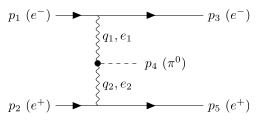

# Topic 4: why the pseudoscalar ($\pi^0$) coupling is the cleanest worked example

### The source passage

> "Let us study the reaction $e^-e^+\to e^-e^+\pi^0$. The $\pi^0$-particle is
> a pseudoscalar state and we will assume here for a moment that we do not
> have to worry about formfactors. We could also try a scalar state, which
> at the moment is more topical because of the Higgs particle, but the
> tricky point that we want to study shows itself more directly with a
> pseudo scalar state."
> — Vermaseren 1983, p.350

### The question

Everything established so far ([Topic 0](topic0-tree-vs-loop.md)–[Topic
3](topic3-subset-sum-proof.md)) is pure kinematics: the double-t-channel
$2\to3$ phase-space machinery (`pickin`/`orient`) that is identical
regardless of what particle sits at vertex $C$. So how is choosing a
*pseudoscalar* specifically related to "the tricky point" the paper wants
to study? This isn't a kinematics question at all — the answer lives in
**section 3 of the paper (p.352-353, the matrix element), not sections
1–2 (kinematics)**. This topic walks through that section slowly, from
the coupling itself, to build the physical picture rather than just
quoting the final formula.

### The diagram (Vermaseren's Fig. 2)



(source: `../figures/pi0_coupling.tex`, redrawn from the paper's Fig. 2 —
the electron and positron each emit one photon; the two photons ($q_1,e_1$
and $q_2,e_2$, where $e_1,e_2$ denote the photon *polarization* vectors,
not the electron) fuse into the $\pi^0$ at a single vertex. This is the
double-t-channel skeleton from [Topic 0](topic0-tree-vs-loop.md) with a
scalar, not a fermion, sitting at vertex $C$.)

### Step 1 — the coupling itself, and why it has this specific form

The paper writes the $\pi^0\gamma\gamma$ coupling as (p.352):

$$\mathcal{L} = \tfrac14 g\,\pi^0 F_{\mu\nu}\tilde F^{\mu\nu}
= -\tfrac14 g\,\pi^0 F_{\mu\nu}F_{\rho\sigma}\,\varepsilon^{\mu\nu\rho\sigma}$$

where $F_{\mu\nu}=\partial_\mu A_\nu-\partial_\nu A_\mu$ is the photon
field strength and $\tilde F^{\mu\nu}=\tfrac12\varepsilon^{\mu\nu\rho\sigma}F_{\rho\sigma}$
is its **dual** — the field strength with $\vec E\leftrightarrow\vec B$
swapped (up to sign), which is what the Levi-Civita tensor does to a
rank-2 antisymmetric tensor in 4D. This is not an arbitrary choice of
operator to illustrate a numerical technique — it is *the* operator, and
essentially the only one available, once two physical facts are imposed:

1. **The $\pi^0$ is spin-0.** A coupling to two photons must be built
   purely from the two photon field strengths (no free Lorentz indices
   left over) — $F_{\mu\nu}$ is the only gauge-invariant object a single
   photon field can supply (using $A_\mu$ directly instead would break
   gauge invariance, since $A_\mu\to A_\mu+\partial_\mu\lambda$ must leave
   the physics unchanged), so the coupling has to be built from $F\otimes
   F$ with all four indices contracted down to a number.
2. **The $\pi^0$ is a *pseudo*scalar** — it flips sign under parity,
   $\pi^0\xrightarrow{P}-\pi^0$, a fact known independently from its decay
   pattern and quark content ($\pi^0\sim u\bar u-d\bar d$ built from a
   $\gamma_5$-type bilinear). $F_{\mu\nu}$ itself is parity-even (it's
   built from $\vec E,\vec B$, and while $\vec E$ is parity-odd and
   $\vec B$ parity-even individually, $F_{\mu\nu}F^{\mu\nu}\sim
   \vec B^2-\vec E^2$ is parity-even overall). To flip parity, the two
   field strengths must be contracted with the **one intrinsically
   parity-odd invariant tensor available in 4D**, the Levi-Civita symbol
   $\varepsilon^{\mu\nu\rho\sigma}$ — which is exactly what $\tilde F$
   supplies. There is no other Lorentz-invariant way to combine two rank-2
   antisymmetric tensors into a parity-odd scalar: $F_{\mu\nu}F^{\mu\nu}$
   is parity-even, and those are the only two independent quadratic
   invariants of a single field-strength tensor.

**Physical intuition:** $F_{\mu\nu}\tilde F^{\mu\nu}\sim\vec E\cdot\vec B$
(up to normalization) — the familiar electrodynamics pseudoscalar. A
$\pi^0\to\gamma\gamma$ vertex built from $\vec E\cdot\vec B$ says: the
$\pi^0$ couples to the *helicity* structure of the two-photon field (how
much the photons' electric and magnetic fields are "twisted" relative to
each other), not to their energy density ($\vec E^2+\vec B^2$-type
combinations, which are parity-even and would describe a *scalar*
coupling instead). This is the same operator that appears in the real
$\pi^0\to\gamma\gamma$ decay Feynman diagram (the triangle anomaly);
Vermaseren is using it here as a stand-in matrix element specifically
*because* its parity structure is unambiguous and simple, not because the
paper is really about pion decay.

### Step 2 — from the coupling to formula (3.1)

Reading the vertex directly off $\mathcal L$: the $\pi^0\gamma\gamma$
vertex Feynman rule is $\propto g\,\varepsilon^{\mu\nu\rho\sigma}
q_{1\rho}q_{2\sigma}$ (the two derivatives in $F_{\mu\nu}=\partial_\mu
A_\nu-\cdots$ become the two photon momenta $q_1,q_2$ once you go to
momentum space, and the two free Lorentz indices $\mu,\nu$ are left open
to contract with the two photon polarization vectors $e_1,e_2$ — or, once
attached to virtual/internal photon lines as here, with whatever Dirac
structure sits at the other end of each photon propagator). Dressing this
vertex with the electron line ($\bar u(p_3)\gamma_\mu u(p_1)$, since the
photon at $\mu$ attaches to the $e^-$ line) and the positron line
($\bar v(p_2)\gamma_\nu v(p_5)$), and dividing by the two photon
propagators $1/q_1^2$, $1/q_2^2$, gives exactly the paper's formula (3.1):

$$|\mathcal{M}|^2 = g^2e^4\left|\frac{\bar u(p_3)\gamma_\mu u(p_1)\,
\varepsilon^{\mu\nu\rho\sigma}q_{1\rho}q_{2\sigma}\,
\bar v(p_2)\gamma_\nu v(p_5)}{q_1^2q_2^2}\right|^2$$

Notice what's *already* true at this stage, before any squaring or
tracing: the numerator is **one single term**. There is no second diagram,
no second Lorentz structure competing with it, and (as Step 1 argued) no
freedom to add another parity-odd structure even if we wanted to — the
Levi-Civita contraction is the unique object available. Contrast this
immediately with a *scalar* coupling ($\pi^0\to\sigma$, parity-even): the
paper notes (p.352) *"For a scalar one obtains similar Levi-Civita tensors
but there are also other terms"* — because for a parity-even coupling,
ordinary dot-product structures like $(q_1\cdot q_2)(e_1\cdot e_2)$ are
*also* available and Lorentz-invariant, so the amplitude is no longer
forced into a single piece. The pseudoscalar case is special precisely
because parity removes that freedom.

### Step 3 — why a single term matters: automatic, individual gauge invariance

The $\gamma^*\gamma^*\to\pi^0$ amplitude, $g\,\varepsilon^{e_1e_2q_1q_2}$
(using the paper's shorthand where a Levi-Civita index contracted with a
4-vector is replaced by that vector), is a **single term**, and — the
paper states this explicitly (p.353, directly under formula 3.2) — it is
*"manifestly gauge invariant"*: replacing either polarization vector
$e_1\to q_1$ or $e_2\to q_2$ (the Ward-identity substitution that tests
gauge invariance) kills the term identically, by the antisymmetry of
$\varepsilon$ alone — a repeated index in an antisymmetric tensor
contraction vanishes term-by-term, with **no need for any other term to
cancel against**. This is the mathematical payoff of Step 1's parity
argument: because there was only one allowed Lorentz structure, gauge
invariance is automatic rather than an emergent property of a sum. Once
this single term is dressed with the electron/positron Dirac traces and
squared, formula (3.2) results:

$$|\mathcal{M}|^2 = g^2e^4[-64\varepsilon^{p_1q_1p_2q_2}
\varepsilon_{p_1q_1p_2q_2} - 16q_1^2\varepsilon^{p_2q_1q_2}
\varepsilon_{p_2q_1q_2\mu}-16q_2^2\varepsilon^{p_1q_1q_2\mu}
\varepsilon_{p_1q_1q_2\mu}-4q_1^2q_2^2\varepsilon^{q_1q_2\mu\nu}
\varepsilon_{q_1q_2\mu\nu}]/(q_1^2q_2^2)^2$$

— and the paper notes directly (p.353): *"If the Levi-Civita tensors are
contracted into 4-vector dot products this formula becomes numerically
unstable, but in its Levi-Civita form all 4 terms are positive so no
cancellations occur... the first term $\varepsilon^{p_1q_1p_2q_2}
\varepsilon_{p_1q_1p_2q_2}$ is the Gram determinant of the system and the
other 3 terms are minors of it, so all four terms have a meaning in the
kinematics."* Every term is a genuine, individually meaningful piece —
not an artifact of a gauge choice that must later cancel against another
term's artifact. **Where these four terms come from mechanically:**
squaring a single Levi-Civita contraction and taking the electron/positron
Dirac traces produces the well-known identity for a product of two
$\varepsilon$ tensors as a determinant of metric contractions (see
[Topic 1](topic1-peaks-and-O2n.md)'s discussion of formula (A.3),
$\Delta_4=\varepsilon^{p_1p_2p_3p_4}\varepsilon_{p_1p_2p_3p_4}$); `part1`
*is* that $4\times4$ Gram determinant, and `part2`,`part3`,`part4` are its
$3\times3$ principal minors (each obtained by contracting away one pair of
indices with the metric instead of a fourth external vector) — the same
determinant/minor relationship the paper's own Appendix A formula (A.11)
uses for $D_1$, one of `pickin.c`'s boundary quantities (`levi.dd1`; see
[Topic 1](topic1-peaks-and-O2n.md)). This is directly visible in the
actual code, `pi0.c`:

```c
double pi0(int par)
{
	double sum, tt = extra.t1*extra.t2;
	double la = (eemminput.mu*eemminput.mu-extra.t1-extra.t2)*0.5;
	double part1 = 0,part2 = 0,part3 = 0,part4 = 0;
	la = -(la*la-tt);
	part1 = -64*levi.gram/(tt*tt);
	part2 = -16*extra.t1*levi.dd2/(tt*tt);
	part3 = -16*extra.t2*levi.dd4/(tt*tt);
	part4 = -4*tt*la/(tt*tt);
	sum = part1+part2+part3+part4;
	return(sum);
}
```

Four terms, `part1..part4`, matching formula (3.2)'s four Levi-Civita
terms exactly, summed directly with **no subtraction anywhere in the
function** — consistent with the paper's claim that all four terms carry
the same sign and there is nothing to cancel.

### Why this makes $\pi^0$ the ideal *pedagogical* vehicle, not the hard case

The genuinely hard case — the one the whole paper (and the $O(2^n)$/
numerical-stability problem discussed in [Topic
1](topic1-peaks-and-O2n.md)) exists to solve — is
$\gamma^*\gamma^*\to\mu^+\mu^-$: **two separate Feynman diagrams**
(crossed muon-exchange, matching the box-diagram topology worked through
in [Topic 0](topic0-tree-vs-loop.md)'s Worked example 2), each of which
is gauge invariant only *jointly with the other*, not individually. Naive
4-vector-dot-product evaluation of either diagram alone contains large
terms that must cancel against the other diagram's terms to enforce
overall gauge invariance — precisely the "severe numerical cancellations"
problem stated in the paper's introduction (p.348: *"the very strong
gauge cancellations in the matrix element"*). Deriving that matrix
element (paper's eq. 3.3 onward: the identity introducing $K_1,K_2$
propagator denominators, the "super formulae," the four separate pieces
$M_{11},M_{12},M_{21},M_{22}$) needs substantially more machinery than
the $\pi^0$ case.

So: **the pseudoscalar choice is not about the reaction being harder or
requiring different kinematics — it's the simplest possible test case for
the Levi-Civita/Gram-determinant *method*** the paper needs for the
genuinely hard multi-diagram QED case. Parity forces $\gamma\gamma\to\pi^0$
into a single, automatically gauge-invariant term — traced here all the
way back to $F_{\mu\nu}\tilde F^{\mu\nu}$ being the unique parity-odd
quadratic invariant of a single photon field strength — so Vermaseren can
demonstrate "write everything in Levi-Civita form instead of dot
products, no cancellations occur" cleanly, on the simplest possible
example, before tackling the case where it's actually needed to solve a
real numerical problem.

See [Topic 5](topic5-s-scaling-pi0.md) for the follow-up question this
raises: "no cancellation between `part1..part4`" does not by itself mean
the sum is well-behaved in $s$ — checked directly, the sum grows like
$s^2$ at fixed small $t_1,t_2$, exactly as much as `part1` alone.

### Step 3, verified: `part2..part4` really are principal minors

Step 3's claim was checked directly, both algebraically and numerically,
rather than left as an analogy.

**Algebraically** ([`scripts/gram_minors_pi0.py`](../scripts/gram_minors_pi0.py)):
the standard identity for contracting one index of two 4D Levi-Civita
tensors with the metric collapses the product into a determinant of dot
products — a cofactor expansion. Building the $4\times4$ Gram matrix of
$(p_1,q_1,p_2,q_2)$ symbolically (massless $e^-,e^+$ beams, so
$p_1^2=p_2^2=0$) and taking its principal minors gives exactly:

- drop $p_1$'s row/column $\to$ the $3\times3$ minor
  $\det\text{Gram}(q_1,p_2,q_2) = -p_2q_2^2\,t_1 + 2\,p_2q_2\,q_1p_2\,q_1q_2 - q_1p_2^2\,t_2$
  (`part2`'s quantity),
- drop $p_2$'s row/column $\to$ $\det\text{Gram}(p_1,q_1,q_2) =
  -p_1q_1^2\,t_2 + 2\,p_1q_1\,p_1q_2\,q_1q_2 - p_1q_2^2\,t_1$ (`part3`'s
  quantity),
- drop both $p_1$'s and $p_2$'s rows/columns $\to$ $\det\text{Gram}(q_1,q_2)
  = t_1t_2 - (q_1{\cdot}q_2)^2$ — exactly `pi0.c`'s `la` term, verified by
  a direct `assert` in the script.

**Numerically**, against the real code
([`kinc2-driver/check_gram_minors.c`](../kinc2-driver/check_gram_minors.c)):
reconstructing these minors from `pickin.c`'s own stored raw dot products
(`dotp.p12`, `dotp.p13`, ..., `dotp.p2k1`) and comparing to
`levi.gram`/`levi.dd2`/`levi.dd4` at several on-shell kinematic points
confirms the identity holds — at "ordinary" points (not extremely close
to the near-real-photon corner) the naive minors agree with `pickin.c`'s
stable quantities to within $0.1$–$0.4\%$:

```
s=20       t1=-1.9752e-05   t2=-3.5272e-05
  part1: naive_gram4=-6.54355e-08    levi.gram=-6.55185e-08    ratio=0.998733
  part2: naive_minor=3.13884e-06     levi.dd2 =3.14026e-06     ratio=0.999546
  part3: naive_minor=1.74156e-06     levi.dd4 =1.74298e-06     ratio=0.999186
```

**But at a genuinely near-real-photon point** ($t_1\sim10^{-11}$), the
naive `part3` minor's three additive terms
($-p_1q_1^2t_2$, $+2p_1q_1\,p_1q_2\,q_1q_2$, $-p_1q_2^2t_1$) are
individually $O(10^{-8})$ while their sum, and `pickin.c`'s stable
`levi.dd4`, are both $O(10^{-9})$ — the naive route gives an answer
**29 times too large and with the wrong sign**:

```
s=20       t1=-6.8096e-11   t2=-0.012767
  part3: term1=8.70702e-16   term2=-3.37331e-08  term3=1.1829e-09
         naive_minor=-3.25502e-08    levi.dd4=1.11581e-09    ratio=-29.171915
```

This is a direct, concrete instance of exactly the "very bad
cancellations between the various terms" the uam19 lecture warns about —
resolving [Topic 5](topic5-s-scaling-pi0.md)'s second open thread as
well: the cancellation is real, it happens *inside* the naive
dot-product expansion of a single minor (not between `part1..part4`
themselves), and `pickin.c` avoids it entirely by never forming that
expansion, computing `levi.dd2`/`dd4` instead from a numerically stable
boundary-root factorization.

### Open threads / not yet resolved

- We have not read the paper's actual derivation of the muon-pair matrix
  element (section 3, eq. 3.3 onward, the "super formulae") in detail —
  only confirmed *why* it's harder than the $\pi^0$ case, not worked
  through *how* the method handles the two-diagram gauge-invariance
  problem concretely.
- The paper's remark that scalar-coupling's extra terms "do not
  contribute to the major numerical disasters" (p.352) is stated but not
  derived here — we have not checked why those particular extra terms
  happen to be numerically benign, only noted that they exist (unlike the
  pseudoscalar case, where no such extra terms exist at all).
